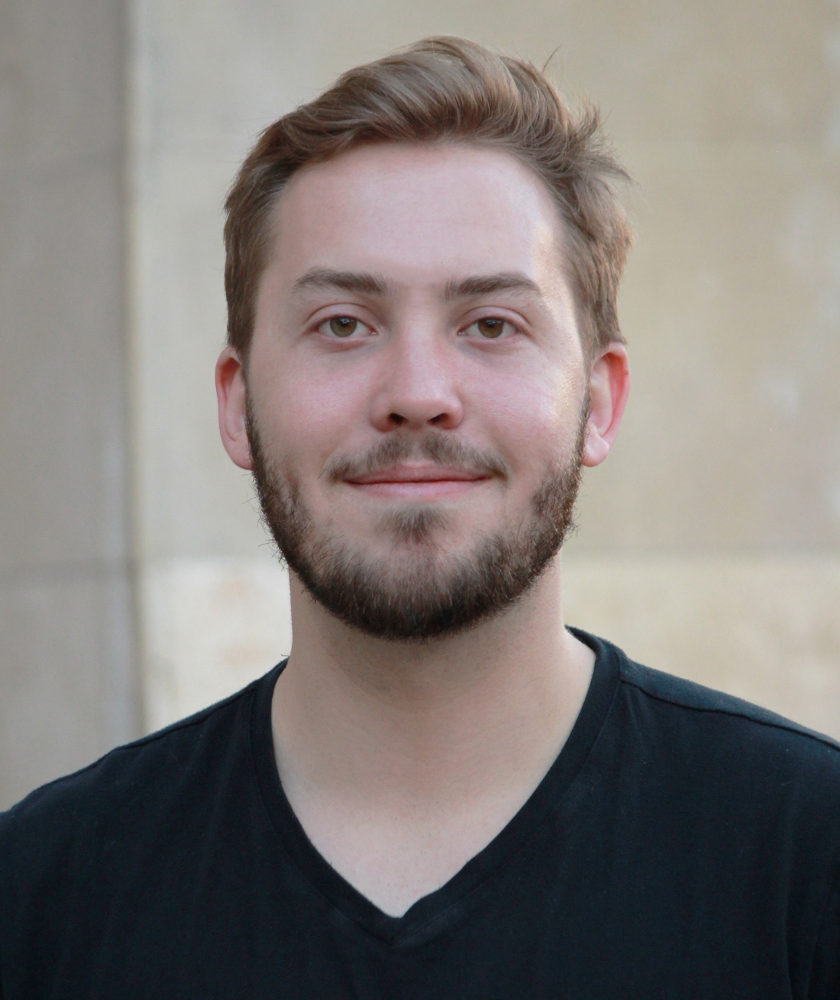

---
# Feel free to add content and custom Front Matter to this file.
# To modify the layout, see https://jekyllrb.com/docs/themes/#overriding-theme-defaults

# I’m a Ph.D. student at Arizona State University studying Computer Science with a focus on Systems Security. You may know me online as mahaloz. I was born and raised on the Big Island, and I’m proudly Native Hawaiian. When I’m not doing research, I like to play in ethical hacking competitions called CTFs with the internationally known team Shellphish as one of the co-captains. I also run the ASU Hacking Club, which is the pipeline to Shellphish.

# I research with the computer security lab SEFCOM at ASU under Dr. Fish Wang and Dr. Yan Shoshitaishvili. I’m interested in most things binary analysis, but I especially like decompilation, the reverse engineering process, and CFG recovery. I also like working on educational outreach material, like the education platform pwn.college, as well as open-source security tools which can be found on my GitHub.

# ---

# I’m Yihui (Kyle) Zeng – a PhD student of School of Computing and Augmented Intelligence at Arizona State University (ASU). My primary advisor is Dr. Tiffany Bao, but I also actively work with Dr. Yan Shoshitaishvili, Dr. Ruoyu (Fish) Wang, and Dr. Adam Doupé. I currently work at SEFCOM with a group of amazing cybersecurity researchers. My research focuses on system security, especially on automated program analysis and vulnerability discovery. I was an intern at University of California, Santa Barbara (UCSB) under the supervision of Dr. Giovanni Vigna and Dr. Christopher Kruegel in 2018.

# I am a core member of the Shellphish CTF team, under the handle “kylebot”. I’m crazy about CTF. I do PWN, Reversing, and sometimes a little bit of Web and Crypto. I have participated DEF CON CTF and entered the finals every year since I joined the team in 2018. Every year, I organize iCTF, one of the largest attack-defense hacking competition in the world.

# I am active in the open-source community: I am a core developer of the binary analysis platform angr, leading the development of the automatic exploitation generation framework rex, maintaining the popular educational heap exploitation project how2heap, and more.

# Recently, under Google’s kCTF VRP program, I successfully performed Container Escape four times with four different novel exploitation techniques in Google Kubernetes Engine (GKE) (and won a lot of cash). In Aug 2022, I was fortunate enough to get the first maximum bounty in kCTF’s entire history (before it raised the bounty). I also participated Pwn2Own and TyphoonPWN and had some wins in the past.

title: /home
layout: home
permalink: /
---


# About Me
Hi! 
I'm **Wil Gibbs** - a Ph.D. student at Airzona State University (ASU) interested in Systems Security.  I currently work at [SEFCOM](https://sefcom.asu.edu/) under [Dr. Ruoyu (Fish) Wang](https://rev.fish/) who is my primary advisor, but I also work closely with [Dr. Adam Doupé](https://adamdoupe.com/), [Dr. Yan SHoshitaishvili](https://yancomm.net/), and [Dr. Tiffany Bao](https://www.tiffanybao.com/).  I have a strong interest in anything binary analysis related with most of my research focus on static analysis.

When I’m not doing Research, I am competing in ethical hacking competitions called CTFs! I am the captain of the internationally known CTF team [Shellphish](https://shellphish.net/) which routinely competes in DEFCON CTF (and has continue to have done so during my time as captain). I started the ASU based CTF team *pwndevils* which has transitioned into the [ASU Hacking Club](http://asuhacking.club/) and pipelines talented hackers directly into Shellphish. I try my best at pwn and rev based challenges (with a sprinkle of web) under the handle *clasm* when competing.

# Publications
## [Ahoy SAILR! There is No Need to DREAM of C: A Compiler-Aware Structuring Algorithm for Binary Decompilation](https://www.zionbasque.com/files/publications/sailr_usenix24.pdf)
Zion Leonahenahe Basque, Ati Priya Bajaj, **Wil Gibbs**, Jude O’Kain, Derron Miao, Tiffany Bao, Adam Doupé, Yan Shoshitaishvili, Ruoyu Wang
_Proceedings of the USENIX Security Symposium, Philadelphia, USA August 2024._
[github](https://github.com/mahaloz/angr-sailr)

## [Greenhouse: Single-Service Rehosting of Linux-Based Firmware Binaries in User-Space Emulation](https://www.usenix.org/system/files/usenixsecurity23-tay.pdf)
Hui Jun Tay, Kyle Zeng, Jayakrishna Menon Vadayath, Arvind S Raj, Audrey Dutcher, Tejesh Reddy, **Wil Gibbs**, Zion Leonahenahe Basque, Fangzhou Dong, Zack Smith, Adam Doupé, Tiffany Bao, Yan Shoshitaishvili, Ruoyu Wang
_Proceedings of the USENIX Security Symposium, Anaheim, USA August 2023._
[github](https://github.com/sefcom/Greenhouse)
```latex
@inproceedings{tay2023greenhouse,
  title={Greenhouse:$\{$Single-Service$\}$ Rehosting of $\{$Linux-Based$\}$ Firmware Binaries in $\{$User-Space$\}$ Emulation},
  author={Tay, Hui Jun and Zeng, Kyle and Vadayath, Jayakrishna Menon and Raj, Arvind S and Dutcher, Audrey and Reddy, Tejesh and Gibbs, Wil and Basque, Zion Leonahenahe and Dong, Fangzhou and Smith, Zack and others},
  booktitle={32nd USENIX Security Symposium (USENIX Security 23)},
  pages={5791--5808},
  year={2023}
}
```

# Honors and Awards

- Partial Win in Camera Category at Pwn2Own (SEFCOM), Toronto, Canada, 2023 
- Partial Win in NAS Category at Pwn2Own (SEFCOM), Toronto, Canada, 2022 
- 13th Place in DEF CON 30 CTF (Shellphish), Las Vegas, USA, 2022 
- 14th Place in DEF CON 29 CTF (Shellphish), Las Vegas, USA, 2021 
- 7th Place in DEF CON 28 CTF (Shellphish), Virtual, 2020 
- 10th Place in DEF CON 27 CTF (Shellphish), Las Vegas, USA, 2019 
- FURI Grant award 2016 (ASU)

# Teaching

- Spring 2022 : Accelerated Applied Security (CSE 598), Instructor of Record
- Spring 2021 : Information Assurance (CSE 365), Teaching Assistant
